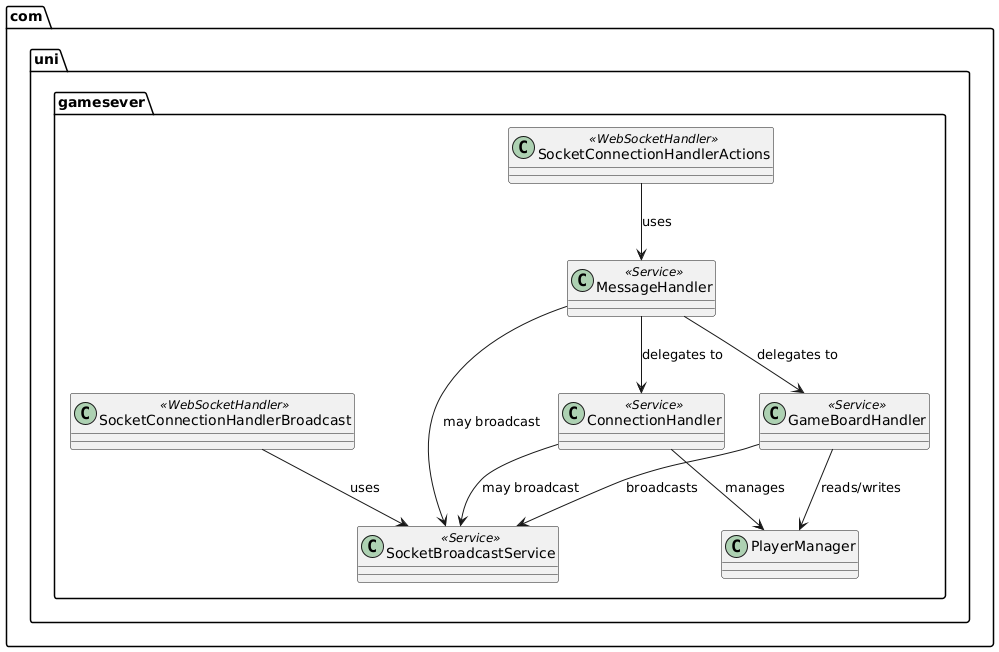

# Das verrückte Labyrinth – Server


Spring Boot WebSocket-Game-Server für **„Das verrückte Labyrinth“** (MCI AIP Projekt WS 2025/26).  
Der Server ist die **Single Source of Truth**: Clients senden Intentionen/Aktionen, der Server validiert und broadcastet den konsistenten Spielzustand.

## Status


**Core Gameplay implementiert** (Lobby, Spielstart, Tile/Pawn Moves, Bonus-Actions).  

**Persistenz**: aktuell **In-Memory** (kein DB-Storage, State geht bei Restart verloren).

## Quick Start

### Voraussetzungen
- **JDK 17+**
- (Optional) Maven lokal – **nicht nötig** für den Server, da **Maven Wrapper** enthalten

### 1) Server starten (Pflicht: `server-registry.base-url`)
> Ohne `server-registry.base-url` startet Spring nicht.

**macOS/Linux**
```bash
cd labyrinth-server
./mvnw spring-boot:run -Dspring-boot.run.arguments="--server-registry.base-url=http://localhost:8080"
```

**Windows (CMD/PowerShell)**
```bat
cd labyrinth-server
mvnw.cmd spring-boot:run -Dspring-boot.run.arguments="--server-registry.base-url=http://localhost:8080"
```

### Port-Hinweis
- Wenn `server.port` **nicht** gesetzt ist, wählt der Server **dynamisch** einen freien Port im Bereich **8397–8405**.
- Für einen fixen Port: `server.port=9000`

### Logs
Standardmäßig werden Logfiles unter:
- `logs/server.log`
- `logs/game.log`
geschrieben (zusätzlich Console-Logs möglich).

## Konfiguration

Konfigurationsdatei: `src/main/resources/application.properties`

Minimal (Pflicht):
```properties
server-registry.base-url=http://localhost:8080
```

Optional (fixer Port / LAN Zugriff):
```properties
# Server auf allen Interfaces erreichbar machen
server.address=0.0.0.0

# Optional fixer Port (sonst dynamisch 8397–8405)
server.port=9000

# Pflicht
server-registry.base-url=http://localhost:8080
```

## Build & Test

### Kompilieren
```bash
./mvnw clean compile
```

### Tests
```bash
./mvnw test
```

### JAR bauen (ohne Tests)
```bash
./mvnw clean package -DskipTests
```

Start der gebauten JAR (Beispiel: fixer Port 9000):
```bash
java -jar target/labyrinth-server-0.1.0-SNAPSHOT.jar \
  --server-registry.base-url=http://localhost:8080 \
  --server.port=9000
```

## WebSocket: Protokoll & Endpoint

### Endpoint
- **URL:** `ws://localhost:<PORT>/game`
- `<PORT>` = dynamisch **8397–8405** oder fixer `server.port`

## Klassendiagram&#x20;


## Projektstruktur (Server)

```text
labyrinth-server/
├── .github/workflows/           # CI/CD Pipelines
├── src/main/java/com/uni/gamesever/
│   ├── GameseverApplication.java
│   ├── config/                  # WebSocket + Bean/Handler Registrierung
│   ├── controller/              # WebSocket Handler
│   ├── services/                # z.B. Broadcast/Session Handling
│   ├── classes/                 # Spiellogik (Lobby, Board, Player, Message Dispatch)
│   └── models/                  # DTOs / Messages / Board Modelle
├── src/main/resources/
│   ├── application.properties
│   └── logback.xml
├── pom.xml
├── Dokumentation.md
└── README.md
```

## CI/CD
- **CI Pipeline**: Build/Validation bei Push/PR auf `main` und `develop`
- **CD Pipeline**: Läuft bei Push auf `main`

## Codestyle
- Codestyle: `CODESTYLE.md`

## Team

**Gruppe 3**
- Clemens Siebers
- Rene Stockinger
- Andreas Rofner
- Mario Gottwald
- Simon Raass
- Manuel Kirchebner
- David Strauß

## Related Repositories

- [Client Repository](https://github.com/AIP-Labyrinth-Group3/labyrinth-client)
- [API Specification](https://github.com/thomasklammer/labyrinth-interface)

## License

Educational project for Advanced Integrative Project at MCI Innsbruck.
